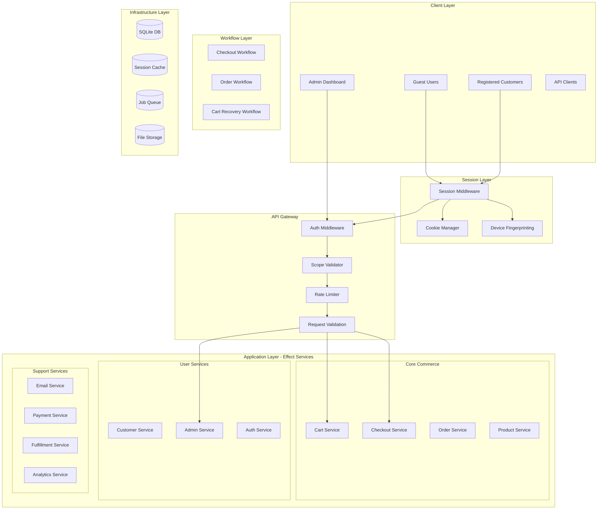
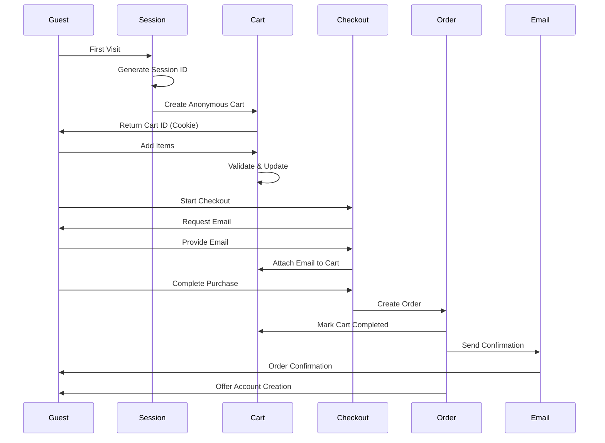
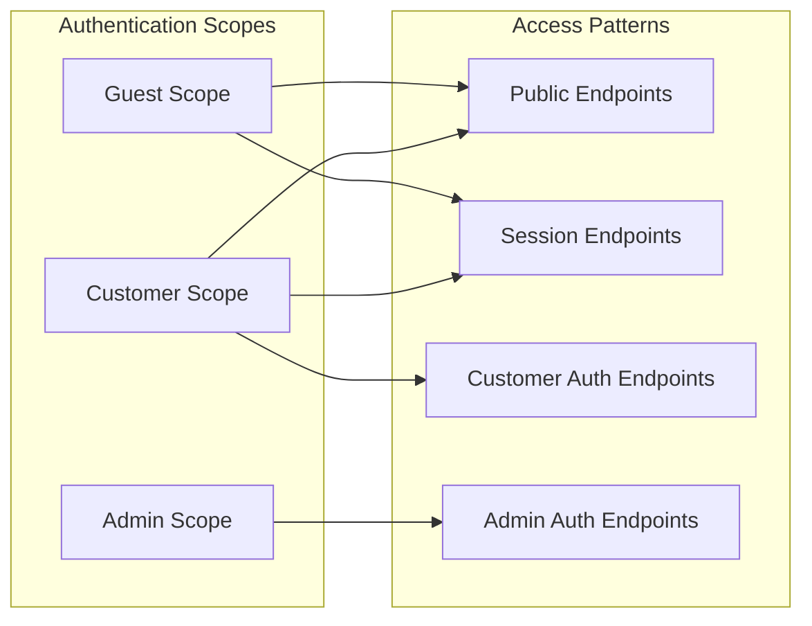
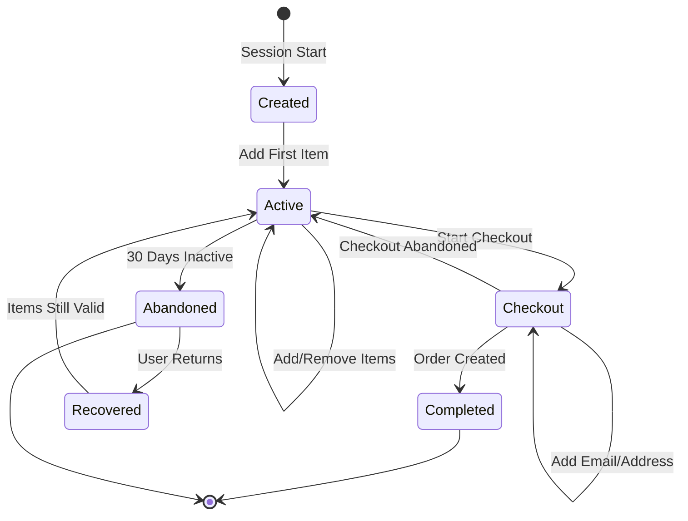
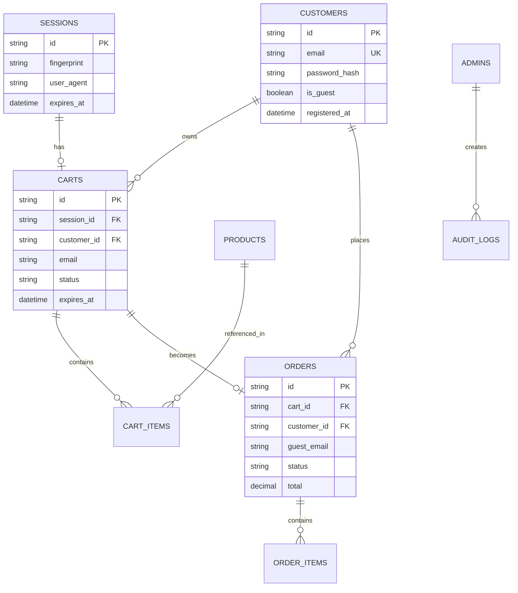

# E-Commerce Backend Architecture V2
*Updated for Guest Checkout and Multi-Actor System*

## System Architecture



## Session-Based Cart Architecture



## Multi-Actor Authentication Flow



## Layer Composition (Updated)

```typescript
// Core Infrastructure Layers
const SessionLive = Layer.mergeAll(
  SessionStoreLive,
  CookieManagerLive,
  DeviceFingerprintLive
)

const DatabaseLive = Layer.mergeAll(
  SqliteClientLive,
  MigrationServiceLive
)

// Repository Layers
const RepositoryLive = Layer.mergeAll(
  CartRepositoryLive,
  ProductRepositoryLive,
  OrderRepositoryLive,
  CustomerRepositoryLive,
  AdminRepositoryLive
).pipe(Layer.provide(DatabaseLive))

// Service Layers
const CommerceServicesLive = Layer.mergeAll(
  CartServiceLive,
  CheckoutServiceLive,
  OrderServiceLive,
  ProductServiceLive
).pipe(Layer.provide(RepositoryLive))

const UserServicesLive = Layer.mergeAll(
  CustomerServiceLive,
  AdminServiceLive,
  AuthServiceLive
).pipe(Layer.provide(RepositoryLive))

// Workflow Layers
const WorkflowLive = Layer.mergeAll(
  CheckoutWorkflowLive,
  OrderWorkflowLive,
  CartRecoveryWorkflowLive
).pipe(Layer.provide(CommerceServicesLive))

// API Layers
const PublicApiLive = Layer.mergeAll(
  ProductApiLive,
  CartApiLive,
  CheckoutApiLive
)

const CustomerApiLive = Layer.mergeAll(
  CustomerProfileApiLive,
  CustomerOrderApiLive
)

const AdminApiLive = Layer.mergeAll(
  AdminProductApiLive,
  AdminOrderApiLive,
  AdminCustomerApiLive,
  AdminAnalyticsApiLive
)

// Complete Application
const AppLive = Layer.mergeAll(
  SessionLive,
  CommerceServicesLive,
  UserServicesLive,
  WorkflowLive,
  PublicApiLive,
  CustomerApiLive,
  AdminApiLive
)

// Server with Middleware
const ServerLive = HttpApiBuilder.serve(
  HttpMiddleware.logger
).pipe(
  // Session middleware runs first
  Layer.provide(SessionMiddlewareLive),
  // Then auth middleware
  Layer.provide(AuthMiddlewareLive),
  // Then rate limiting
  Layer.provide(RateLimitMiddlewareLive),
  // Application layer
  Layer.provide(AppLive),
  // HTTP server
  HttpServer.withLogAddress,
  Layer.provide(BunHttpServer.layer({ port: 3000 }))
)
```

## Cart Lifecycle Management



## Database Schema Relationships



## Workflow Architecture

### Checkout Workflow Steps
```typescript
const checkoutWorkflow = workflow("checkout", {
  steps: [
    {
      name: "validateCart",
      run: ({ cartId }) => CartService.validate(cartId),
      compensate: ({ cartId }) => CartService.unlock(cartId)
    },
    {
      name: "captureEmail",
      run: ({ cartId, email }) => CartService.setEmail(cartId, email)
    },
    {
      name: "calculateTotals",
      run: ({ cartId, shippingMethod }) => 
        CheckoutService.calculateTotals(cartId, shippingMethod)
    },
    {
      name: "processPayment",
      run: ({ payment }) => PaymentService.process(payment),
      compensate: ({ paymentId }) => PaymentService.reverse(paymentId)
    },
    {
      name: "createOrder",
      run: ({ cartId, paymentId }) => 
        OrderService.createFromCart(cartId, paymentId),
      compensate: ({ orderId }) => OrderService.cancel(orderId)
    },
    {
      name: "sendConfirmation",
      run: ({ orderId, email }) => 
        EmailService.sendOrderConfirmation(orderId, email)
    }
  ]
})
```

## Security Architecture (Updated)

### Authentication Levels
```typescript
enum AuthLevel {
  NONE = 0,        // Public endpoints
  SESSION = 1,     // Valid session required
  CUSTOMER = 2,    // Customer JWT required
  ADMIN = 3        // Admin JWT required
}

// Endpoint security mapping
const securityMap = {
  "GET /products": AuthLevel.NONE,
  "GET /cart": AuthLevel.SESSION,
  "POST /checkout/complete": AuthLevel.SESSION,
  "GET /customers/me": AuthLevel.CUSTOMER,
  "GET /admin/orders": AuthLevel.ADMIN
}
```

### Session Security
- HTTP-only cookies for session IDs
- Secure flag in production
- SameSite=Lax for CSRF protection
- 30-day expiration with sliding window
- Device fingerprinting for recovery

## Performance Optimizations

### Caching Strategy
```typescript
// Cache layers for different data types
const CacheLive = Layer.mergeAll(
  // Product catalog - 5 minute TTL
  ProductCacheLive.pipe(
    Layer.provide(RedisCacheLive({ ttl: 300 }))
  ),
  
  // Session data - 1 hour TTL
  SessionCacheLive.pipe(
    Layer.provide(RedisCacheLive({ ttl: 3600 }))
  ),
  
  // Cart data - No cache, always fresh
  CartCacheLive.pipe(
    Layer.provide(NoOpCacheLive)
  )
)
```

### Database Optimization
- Indexes on frequently queried fields
- Separate read replicas for analytics
- Connection pooling
- Query result caching

## Monitoring & Observability

### Key Metrics
1. **Conversion Funnel**
   - Sessions created
   - Carts with items
   - Checkouts started
   - Orders completed

2. **Performance Metrics**
   - API response times by endpoint
   - Database query performance
   - Cache hit rates
   - Session recovery success rate

3. **Business Metrics**
   - Average order value
   - Cart abandonment rate
   - Guest vs registered conversion
   - Admin task completion time

### Health Checks
```typescript
const healthChecks = {
  database: () => SqlClient.execute("SELECT 1"),
  cache: () => Cache.ping(),
  payment: () => PaymentService.healthCheck(),
  email: () => EmailService.healthCheck()
}
```

This architecture prioritizes conversion through guest-friendly flows while maintaining security and scalability for growth.